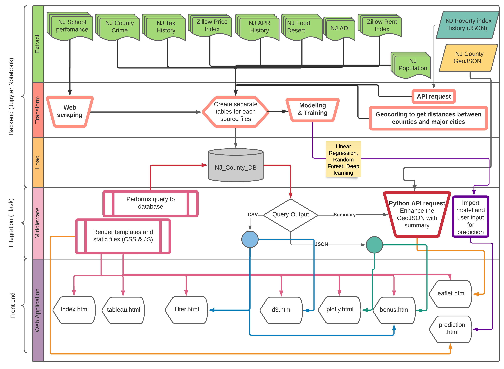

# Project - NJ Movers Guide - Capstone

# Our Goals
## Our goal is to create a guide that would educate potential movers on where to live in New Jersey based on certain criteria such geography, crime rate, education level, and tax rate etc. .

# Our Process

# Our Challenges & Solutions

Our biggest challenege from the Data sources was combining the all the different sets that would be useable for us. We had to convert the data, clean the data, synchronize key names such as country names, create a new json from Sqlite, and merge multiple json and geojsons. 

## Our Data Sources

 #### Tax Rate Data
 https://www.state.nj.us/treasury/taxation/lpt/taxrate.shtml
 #### County Lines and Shape Data
 http://data.ci.newark.nj.us/dataset/new-jersey-counties-polygon/resource/95db8cad-3a8c-41a4-b8b1-4991990f07f3
 #### NJ School Rank Data
 https://www.schooldigger.com/go/NJ/schoolrank.aspx
 #### Crime Data
 https://www.njsp.org/ucr/current-crime-data.shtml
 #### Mortgage Rate Data
 http://www.freddiemac.com/pmms/#
 #### Zilow house price and rentals Data
 https://www.zillow.com/research/data/
 #### USDA Food Atlas
 https://www.ers.usda.gov/data-products/food-access-research-atlas/
 #### Area Deprivation Index
 https://www.neighborhoodatlas.medicine.wisc.edu/download
 #### Poverty Data
 https://api.census.gov/data/timeseries/poverty/saipe?get=NAME,SAEMHI_PT,SAEMHI_MOE,SAEPOVALL_PT,SAEPOVALL_MOE,SAEPOVRTALL_MOE,SAEPOVRTALL_PT,STABREV&for=county:*&in=state:34&YEAR=2019

## D3 Page
  1) The X-Axis is based on Poverty Rate, Average School Rank, House Hold Median Income
  2) The Y-Axis is based Crime Data which are Crime Rate per 100K, Total Offense, Total Arrest.
With this anyone can compare any of the X axis, and be measured against the data on the Y axis. The chart will plot the counties data based on which X and Y axis pair are activated.

## Plotly Page
 1. Drop Down Menu is provided to select County Names which will provide general ifnformation on each County.
 2. The Horizantal Bar Chart ranks the top 10 schools per country.
 C, The Gauge Chart shows the Median Income for the county and compares it to the State Median Income. For Example Morris County has median income of $116.3k which will show a +31.2K indicating it is about $31,200 greater than the states median. Unlike Cumberland County which a m.i of 54.2k and is 31k lesser than the States.
 3. The Bubble Chart is based on the Crime Date Data. The bigger the bubble the more pronounce and frequent that particular crime is on that county compared to other crimes.
 4. With this anyone can look at this summarize page of each county and determine if they think it fits there criteria of a place to live in.
 
 ## Leaflet
  1. We went through various design iterations with the Leaflet in showing our Data. 
     1. We started off regular markers with a simple popup.
     2. We flirted with custom icons that uses Star War Images where the icons were base on the county Summative Score, and the size based on Tax Rate.
     3. We did circles where Summative Score showed color, and circle size based on Tax Rate.
  2. Finally we decided to remove the clutter and simplified the Leaflet design.
     1. Where the County Fill Color is based on the county Crime Rate per 100k. The Darker the color the higher the crime Rate
     2. The top border of the county line will show the tax rate. The lighter shade of blue will indicate a lower Tax Rate.
     3. When someone hovers on a county a summary of the general info will pop up.
  3. This page is to help a person make a decision based on the the geography and location.

  
  ## Source Data Set
  Drop down menu where you can see all the source data set and filter each data set by their column values.
  
  
  ## Bonus
   Explore and see !!!

  ## Instructions
  1. Clone the Repo
  2. Update the config key with your leaflet Api Key under \static\js\config.js
  3. Update leaflet.html line 88 to: 
  3. Run app.py
